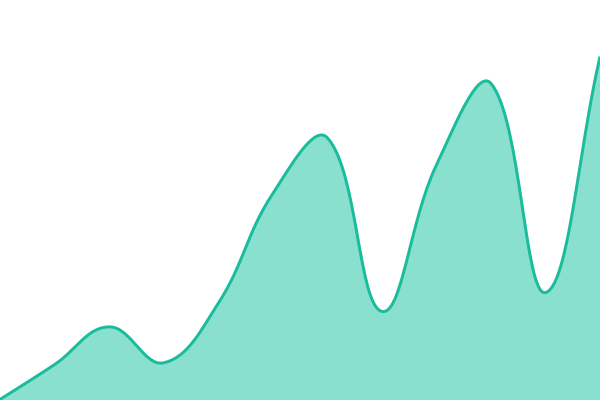
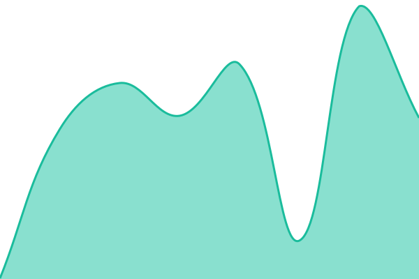
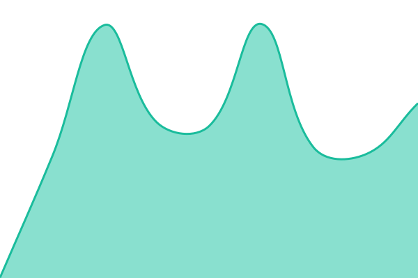

# [📈 Live Status](https://marukun712.github.io/status-page): <!--live status--> **🟧 Partial outage**

This repository contains the open-source uptime monitor and status page for [Haruma Yasuda](https://maril.blue), powered by [Upptime](https://github.com/upptime/upptime).

With [Upptime](https://upptime.js.org), you can get your own unlimited and free uptime monitor and status page, powered entirely by a GitHub repository. We use [Issues](https://github.com/marukun712/status-page/issues) as incident reports, [Actions](https://github.com/marukun712/status-page/actions) as uptime monitors, and [Pages](https://marukun712.github.io/status-page) for the status page.

<!--start: status pages-->
<!-- This summary is generated by Upptime (https://github.com/upptime/upptime) -->
<!-- Do not edit this manually, your changes will be overwritten -->
<!-- prettier-ignore -->
| URL | Status | History | Response Time | Uptime |
| --- | ------ | ------- | ------------- | ------ |
|  [maril.blue](https://maril.blue) | 🟩 Up | [maril-blue.yml](https://github.com/marukun712/status-page/commits/HEAD/history/maril-blue.yml) | 

 255ms
     
 | 

<a href="https://marukun712.github.io/status-page/history/maril-blue">85.00%</a>
    

|  [ll-wiki](https://ll-wiki.maril.blue) | 🟥 Down | [ll-wiki.yml](https://github.com/marukun712/status-page/commits/HEAD/history/ll-wiki.yml) | 

 0ms
     
 | 

<a href="https://marukun712.github.io/status-page/history/ll-wiki">0.00%</a>
    

|  [N高ラブライブ同好会HP](https://maril.blue/n-high-lovelive) | 🟩 Up | [n-hp.yml](https://github.com/marukun712/status-page/commits/HEAD/history/n-hp.yml) | 

 219ms
     
 | 

<a href="https://marukun712.github.io/status-page/history/n-hp">100.00%</a>
    

|  [NetBird](https://netbird.maril.blue/) | 🟩 Up | [net-bird.yml](https://github.com/marukun712/status-page/commits/HEAD/history/net-bird.yml) | 

 539ms
     
 | 

<a href="https://marukun712.github.io/status-page/history/net-bird">100.00%</a>
    

|  [syakechan cluster](https://syakechan.maril.blue/) | 🟥 Down | [syakechan-cluster.yml](https://github.com/marukun712/status-page/commits/HEAD/history/syakechan-cluster.yml) | 

 717ms
     
 | 

<a href="https://marukun712.github.io/status-page/history/syakechan-cluster">96.48%</a>
    

<!--end: status pages-->

[**Visit our status website →**](https://marukun712.github.io/status-page)

## 📄 License

- Powered by: [Upptime](https://github.com/upptime/upptime)
- Code: [MIT](./LICENSE) © [Anand Chowdhary](https://anandchowdhary.com)
- Data in the `./history` directory: [Open Database License](https://opendatacommons.org/licenses/odbl/1-0/)
